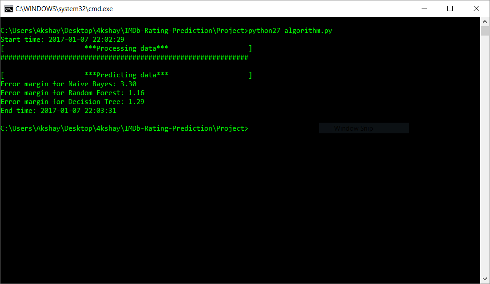

# Predicting Movie Ratings Using IMDb Dataset
A machine learning research project and paper analyzing the efficiency of different ML algorithms using evaluation metrics and drawing a comparison between them.
The data is split into training data and testing data in an 80:20 ratio in accordance with the Pareto Principle.
The algorithms analyzed in this project are: SVM, Random Forest, Decision Trees and Naive Bayes.

## Usage
Type the following command to run the program:
```python
python algorithm.py
```

The output will be something similar to:
```
Start time: 2017-01-01 15:04:42
[                    ***Processing data***                    ]
##############################################################

[                    ***Predicting data***                    ]
Error margin for Naive Bayes: 3.30
Error margin for Random Forest: 1.13
Error margin for Decision Tree: 1.23
End time: 2017-01-01 15:05:59
```



## Bugs and Feedback
For bugs, questions and discussions please use the [Github Issues](https://github.com/aksh4y/IMDb-Rating-Prediction/issues).
